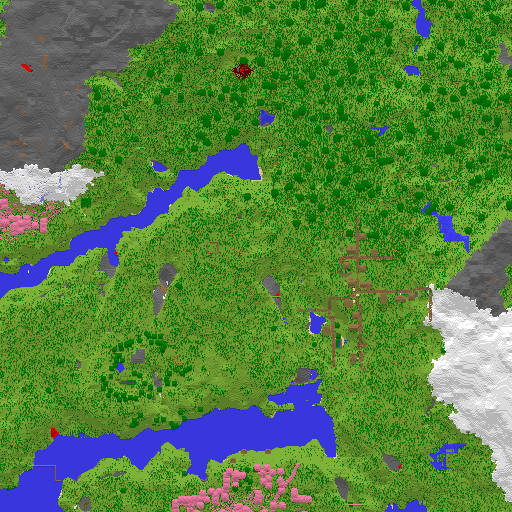

# Minecraft Map Image Generator

Copy the Minecraft en-us.json file from the assets folder (required to generate
the block name to color mapping).

Generate `colors.h` using `ts-node getblockmapping.ts`

Compile with `gcc ./main.c -O3 -o image-generator -lz -lpng -Werror`

Usage: `./image-generator [region folder] [output folder]`

## Example

